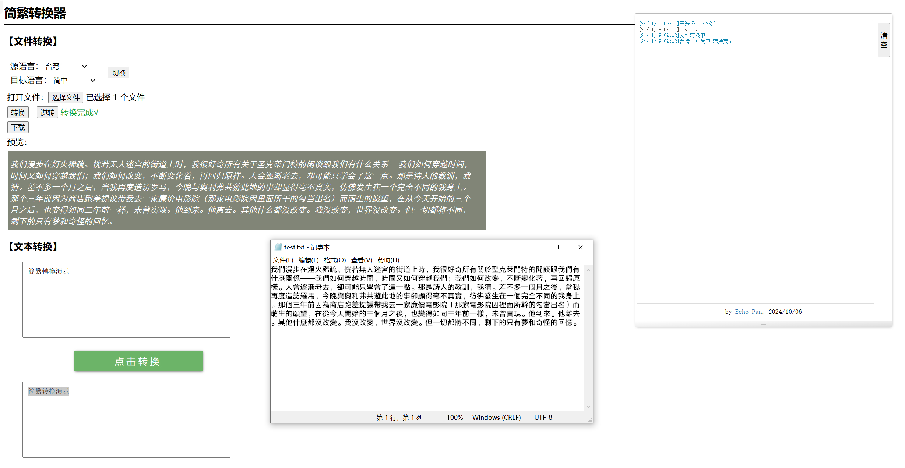

# Chinese-Converter

简繁转换器

## 特点

⭐网页UI⭐离线使用⭐批量转换⭐纯文本⭐操作日志

## 用法

下载仓库全部文件到本地, 打开`Chinese-Converter.html`使用.

## 截图

## 依赖

|项目|作用|
|-|-|
|[**opencc-js**](https://github.com/nk2028/opencc-js)|中文转换|
|[**jszip**](https://github.com/Stuk/jszip)|生成压缩包|
|[**jschardet**](https://github.com/aadsm/jschardet)|文件编码检测|
|[**jquery**](https://releases.jquery.com/)|简化代码|

## License 许可协议

[Apache License 2.0](https://github.com/echopan/Chinese-Converter?tab=Apache-2.0-1-ov-file#)
